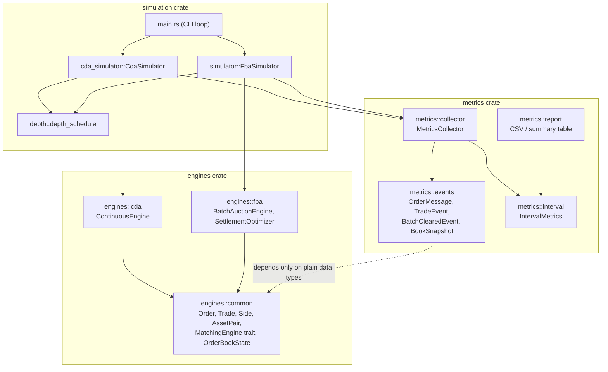
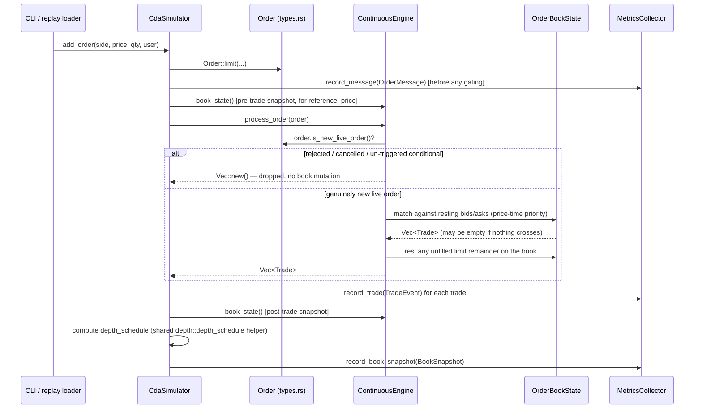

# Engine Design Notes

Reference documentation for how the matching engines actually work, kept next
to the code rather than in the thesis exposé (repo-root `docs/expose.tex`,
one level up from `thesis-market-models/`) so it can stay precise and change
with the implementation. Two parts:

1. [How the FBA auction price is calculated](#1-how-the-fba-auction-price-is-calculated)
2. [Order flow: module interaction from submission to settlement](#2-order-flow-module-interaction-from-submission-to-settlement)

All line references are to `engines/src/fba/clearing.rs` unless stated
otherwise, and reflect the code as of this writing.

---

## 1. How the FBA auction price is calculated

### 1.1 The core idea

The FBA does not match orders one pair at a time the way the CDA does.
Instead it collects a whole batch of orders (`BatchAuctionEngine.orders`) and
computes **one single price** — the *uniform clearing price* — that every
trade in that batch executes at. The price is chosen to **maximize the total
quantity that can be matched**. This is the standard uniform-price
call-auction rule (Budish, Cramton & Shim, 2015).

### 1.2 Step by step

**Step 1 — Candidate prices** (`candidate_prices`, function at line 167)

Only prices that were actually submitted as a limit price are considered —
never an arbitrary price in between. This is safe because demand and supply
are step functions that only change value at a submitted limit price, so the
volume-maximizing price is always achievable at one of them. Market orders
never contribute a candidate (they carry no price).

**Step 2 — Evaluate every candidate** (`select_price` + `aggregate_volume`,
lines 189–247)

For each candidate price `P`:

| Quantity | Definition |
|---|---|
| `demand(P)` | Sum of remaining quantity across all buy orders with limit `≥ P`, plus every buy market order (willing to transact at any price) |
| `supply(P)` | Sum of remaining quantity across all sell orders with limit `≤ P`, plus every sell market order |
| `matched_volume(P)` | `min(demand(P), supply(P))` |
| `imbalance(P)` | `\|demand(P) − supply(P)\|` |

**Step 3 — Pick the winning price**, three tiers in order:

1. **Maximize** `matched_volume(P)` across all candidates.
2. Tie → **minimize** `imbalance(P)` (fewer orders left unmatched).
3. Still tied → **pick the price closest to `last_clearing_price`** — the
   price this engine last actually cleared a trade at. This prevents the
   clearing price from jumping around for no reason when several candidates
   are mathematically equivalent; it's the same continuity convention real
   call auctions use (e.g. an opening cross referencing the prior close).
   With no price history yet (very first batch), it deterministically picks
   the lower candidate instead.

```
for each candidate price P:
    compute demand(P), supply(P), volume(P), imbalance(P)
    P is better than the current best if:
        volume(P) > best.volume                                   -- tier 1
        OR (volume(P) == best.volume AND imbalance(P) < best.imbalance)   -- tier 2
        OR (volume(P) == best.volume AND imbalance(P) == best.imbalance
            AND |P - last_clearing_price| < |best - last_clearing_price)  -- tier 3
```

**Special case — a batch with no limit orders at all** (e.g. every order
happens to be a market order): there is no price information in the batch to
work with, so `candidate_prices` falls back to `last_clearing_price` as the
*only* candidate. If there is no price history either (the very first batch
this engine has ever seen), there is nothing to anchor on and the batch
simply does not clear — `clear_orders` returns `None`, no trades execute.

**Step 4 — Every trade in the batch executes at that one price.** Line 127,
`price: clearing_price`, is the same value for every `Trade` pushed inside
the matching loop. That is the defining uniform-price property — unlike the
CDA, where each trade prices at whatever the resting maker's own limit was.

**Step 5 — Rationing the heavier side.** If `demand(P*) ≠ supply(P*)`, the
larger side cannot be filled in full. Both sides are sorted by **price-time
priority** (`eligible_orders` / `order_priority`, lines 258–286): most
aggressive price first (market orders ahead of every limit order), and
among orders at the same price, earliest submission time wins. The matching
loop then walks both sorted lists head-to-head, filling from the front of
each until one side runs out — which is always the side with less volume.
The orders left partially or fully unfilled are always exactly the ones
sitting *at* the clearing price (never a strictly-better-priced order), and
among those, later-submitted ones lose out first.

### 1.3 Worked example

Batch, candidate price `P = 100`:

| Order | Side | Limit | Qty | Submitted |
|---|---|---|---|---|
| B1 | Buy | 105 | 10 | t=1 |
| B2 | Buy | 100 | 10 | t=2 |
| B3 | Buy | 100 | 10 | t=3 |
| S1 | Sell | 90 | 15 | t=1 |

At `P=100`: `demand = 30`, `supply = 15` → `matched_volume = 15` (this is the
volume-maximizing price for this batch). Sorted by priority: buys = `[B1,
B2, B3]`, sells = `[S1]`.

1. B1 (best price) matches 10 units against S1 → **B1 fully filled**.
2. S1 has 5 left → matches against B2 (earlier of the two orders tied at
   100) → **B2 filled 5/10**, S1 fully consumed.
3. Loop ends (seller side exhausted). **B3 gets 0.**

Everyone strictly better than 100 fills first and in full; between the two
orders tied exactly at the clearing price, the earlier one wins the
remaining capacity. Price-time priority falls straight out of the
sequential matching loop — no separate rationing step is needed.

### 1.4 What this deliberately does *not* do

- **No external liquidity source.** There is no AMM or other counterparty of
  last resort. Unmatched volume on the heavier side simply stays unexecuted
  and rolls over to the next batch (`FbaSimulator::clear_window`).
- **No multi-asset routing.** The engine trades a single fixed pair
  (`AssetPair::default()`, SOL/USD) — one batch, one clearing price, no
  per-pair bucketing.
- **No general LP solver.** For a single asset the volume-maximizing price
  has a closed-form solution (the candidate scan above), so no external
  linear-programming dependency is needed at runtime. An earlier LP-encoder
  module existed purely for a theoretical write-up and was never called by
  the working engine; it has since been removed as dead code — the
  closed-form scan above is the only clearing-price implementation.

---

## 2. Order flow: module interaction from submission to settlement

### 2.1 Module map



The key boundary: **`engines` never imports `metrics`.** The simulation
crate is the only thing that knows both exist — it drives an engine, turns
its output into plain events, and hands them to a `MetricsCollector`.

### 2.2 FBA path — from `add` to a settled batch

```mermaid
sequenceDiagram
    participant CLI as CLI / replay loader
    participant Sim as FbaSimulator
    participant Order as Order (types.rs)
    participant Engine as BatchAuctionEngine
    participant Metrics as MetricsCollector
    participant Opt as SettlementOptimizer

    CLI->>Sim: add_order(side, price, qty, user)
    Sim->>Order: Order::limit(...) — status_id=1, is_ask, limit_px, ts, ...
    Sim->>Metrics: record_message(OrderMessage) [before any gating]
    Sim->>Sim: pending_orders.push(order)

    Note over CLI,Sim: ...more add_order calls accumulate the batch...

    CLI->>Sim: clear_window()
    Sim->>Engine: submit(order) for each pending order
    Engine->>Order: order.is_new_live_order()?
    alt rejected / cancelled / un-triggered conditional
        Engine-->>Engine: dropped, never enters self.orders
    else genuinely new live order
        Engine-->>Engine: pushed into self.orders
    end

    Sim->>Engine: clear()
    Engine->>Engine: candidate_prices() -> select_price() [§1]
    Engine->>Engine: eligible_orders() sorted by price-time priority
    Engine->>Engine: sequential matching loop -> Vec<Trade>
    Engine-->>Sim: Option<ClearingResult>

    Sim->>Metrics: record_trade(TradeEvent) for each trade
    Sim->>Opt: optimize_trades(&trades) [netting, unrelated to price]
    Sim->>Sim: compute residual_orders, best_unfilled_buy/sell
    Sim->>Metrics: record_batch(BatchClearedEvent)
    Sim->>Sim: residual_orders pushed back into pending_orders
```

Two things worth calling out because they're easy to miss reading the code
top-to-bottom:

- **The metrics collector sees the *raw* message stream, before gating.**
  `record_message` happens in `add_order`, unconditionally — including
  orders that `is_new_live_order()` will later reject. This is deliberate:
  metrics like the order-to-trade ratio need to see rejected/cancelled
  messages too, not just what the engine chose to accept (see
  `metrics::events::OrderMessage` doc comment).
- **Residual handling is a `simulation`-crate concern, not an
  `engines`-crate one.** `BatchAuctionEngine::clear()` just returns whatever
  matched; it's `FbaSimulator::clear_window()` that computes what's left
  over and decides to roll it into the next batch.

### 2.3 CDA path — from `add` to an instant match



The CDA has no batch boundary — every order is matched (or rested)
immediately, so there's no equivalent of `clear_window()`. The
`MetricsCollector` still buckets everything into the same time grid as the
FBA collector, so the two can be compared interval-by-interval later.

### 2.4 Where the two paths reconverge: metrics

Both wrappers feed the exact same `MetricsCollector` shape
(`metrics::events` types), just with different events populated (the FBA
never produces `BookSnapshot`s; the CDA never produces `BatchClearedEvent`s).
`MetricsCollector::finalize()` buckets everything by timestamp into
`interval_width`-wide windows and computes the full metric catalogue —
see `metrics/src/collector.rs` for the formulas and the thesis exposé's
Metric Catalogue section (repo-root `docs/expose.tex`) for what each one means.

```
Order submitted  ─┬─> OrderMessage  ──┐
Trade produced   ─┼─> TradeEvent    ──┼─> MetricsCollector ──finalize()──> Vec<IntervalMetrics>
Batch cleared    ─┼─> BatchClearedEvent
Book snapshotted ─┴─> BookSnapshot  ──┘
```

At the CLI, `metrics` / `stats` prints a summary table for both engines
(`display::render_metrics`); `metrics::report::to_csv` exports the full
catalogue for external analysis.
